# R でデータからグラフ描画

自分用のメモで説明が少なめです。

- ソフトウェア情報
  - R-4.4.2 for Windows (83 megabytes, 64 bit)
  - RStudio  Version: 2024.09.1+394 | Released: 2024-11-04
  - package
    - dplyr  .. 2.5.0 
    - ggplot2 .. 3.5.1
    - survival .. 3.7-0
    - survminer .. 0.5.0
    - tidyverse .. 2.0.0

- ソース

  https://github.com/fnamuoo/R/blob/main/data2graph_test8.R

## サマリ

- [ベクトル（１：重複なし）](#ベクトル１重複なし)：同ページ内リンク

    ```R
    # [5,7,3]
    ```

    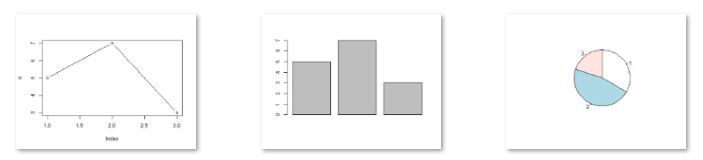

- [ベクトル（２：重複あり）](#ベクトル２重複あり)：同ページ内リンク

    ```R
    # [1, 3, 3, 2, 1, 3, ...]
    ```

    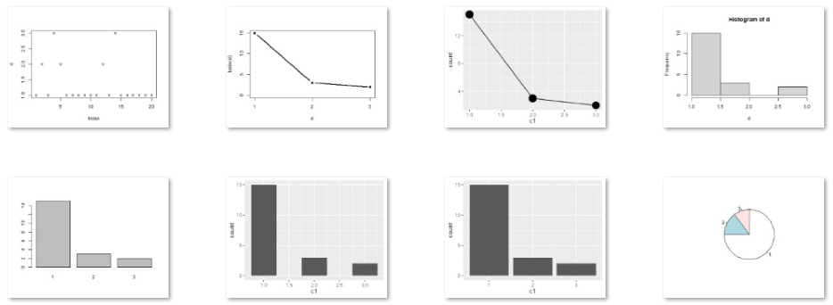

- [ベクトル（３：カテゴリ分類操作あり）](#ベクトル３カテゴリ分類操作あり)：同ページ内リンク

    ```R
    # [3964, 3026, 4755, 6330, 8538, 5981, ...]
    ```

    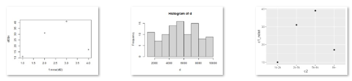

- [matrix](#matrix)：同ページ内リンク

    ```R
    #      [,1] [,2] [,3] [,4] [,5]
    # [1,]    5    7    9   11   13
    # [2,]   16    8    4    2    1
    ```

    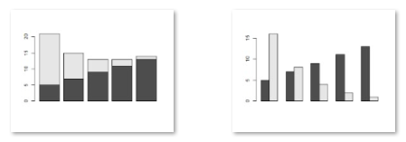

- [データフレーム（１：連続値ｘ２）](#データフレーム１連続値ｘ２)：同ページ内リンク

    ```R
    #   c1 c2
    # 1  5 16
    # 2  7  8
    # 3  9  4
    # 4 11  2
    # 5 13  1
    ```

    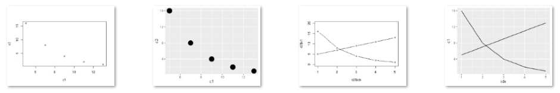

- [データフレーム（２：カテゴリ値と連続値）](#データフレーム２カテゴリ値と連続値)：同ページ内リンク

    ```R
    #   c1 c2
    # 1  a  3
    # 2  b  7
    # 3  c  5
    ```

    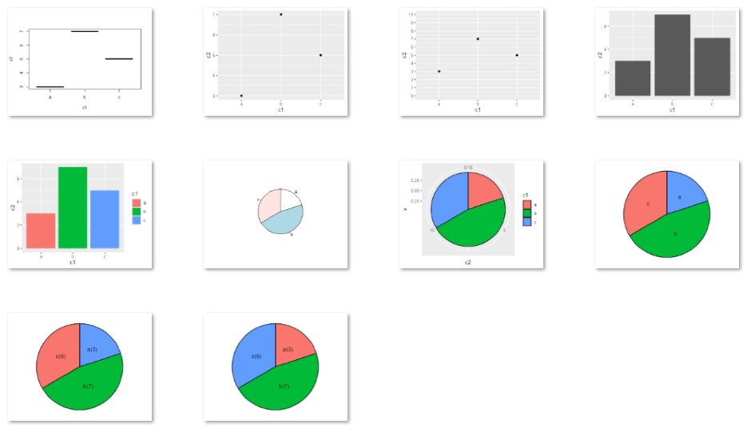

- [データフレーム（３：カテゴリ値と連続値／カテゴリの重複）](#データフレーム３カテゴリ値と連続値／カテゴリの重複)：同ページ内リンク

    ```R
    #   c1 c2
    # 1  a  1
    # 2  a  1
    # 3  a  2
    # 4  a  3
    # 5  b  5
    # 6  c  8
    ```

    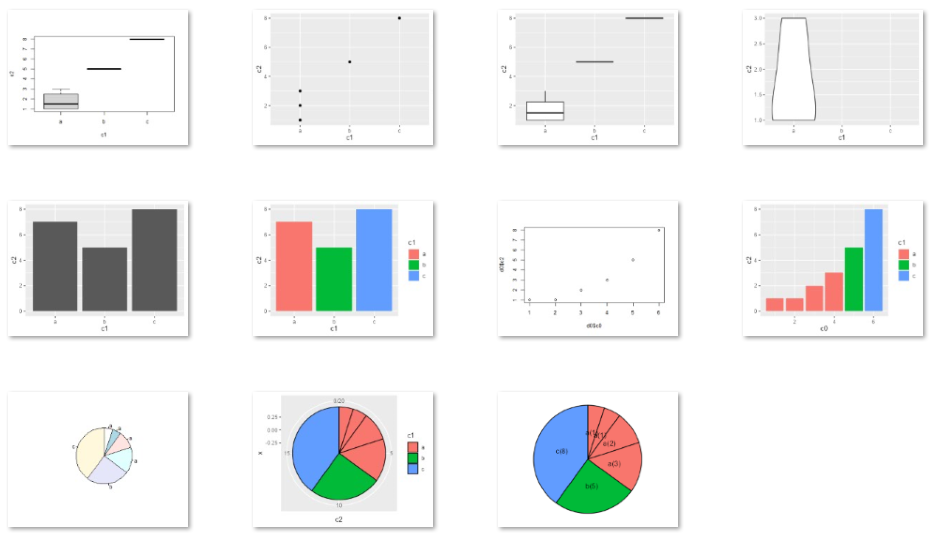

- [データフレーム（４：連続値×３）](#データフレーム４連続値×３)：同ページ内リンク

    ```R
    #   c1 c2 c3
    # 1 11  5 16
    # 2 12  7  8
    # 3 13  9  4
    # 4 14 11  2
    # 5 15 13  1
    ```

    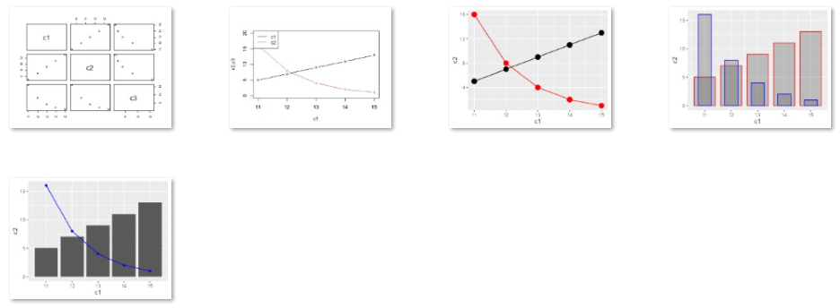

- [データフレーム（５：連続値×２とカテゴリ値）](#データフレーム５連続値×２とカテゴリ値)：同ページ内リンク

    ```R
    #    c1 c2 c3
    # 1  11  5  a
    # 2  12  7  a
    # 3  13  9  a
    # 4  14 11  a
    # 5  15 13  a
    # 6  11 16  b
    # 7  12  8  b
    # 8  13  4  b
    # 9  14  2  b
    # 10 15  1  b
    ```

    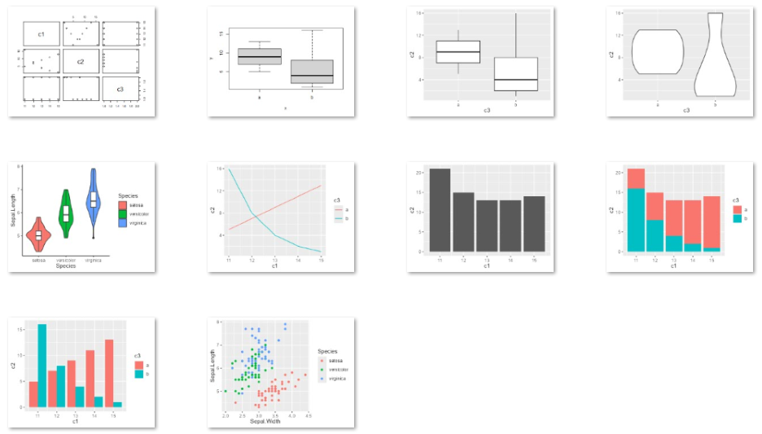

- [データフレーム（６：連続値とカテゴリ値×２）](#データフレーム６連続値とカテゴリ値×２)：同ページ内リンク

    ```R
    #   c1 c2 c3
    # 1  1  a XX
    # 2  1  a XX
    # 3  2  a XX
    # 4  3  a YY
    # 5  5  b XX
    # 6  8  b XX
    ```

    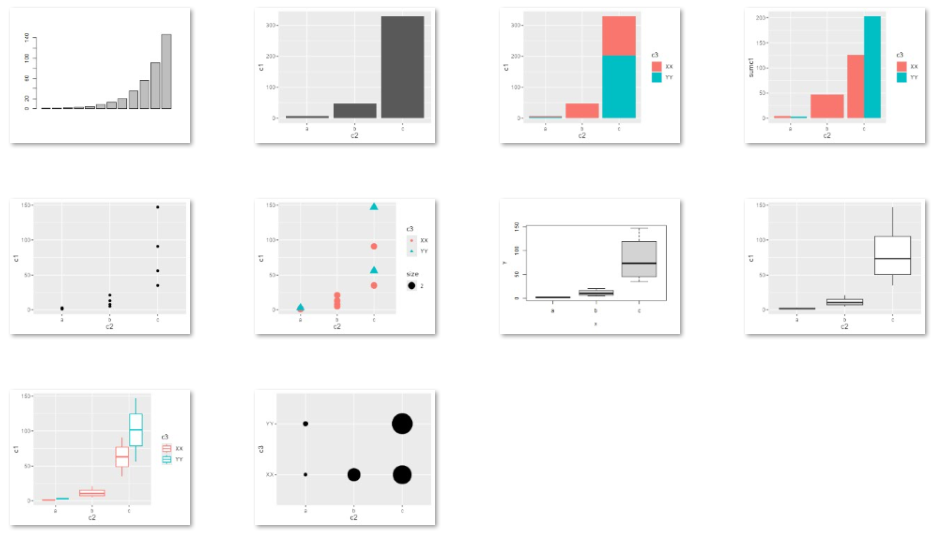

----------------------------------------------------------------------

## ベクトル（１：重複なし）

### データ

| vector | r1 | r2 | r3 |
|--------|----|----|----|
|  c1    |  5 |  7 |  3 |

（表示の都合で転置、横方向に）

```R
# [5,7,3]
d = c(5,7,3)
```

#### データの中身を確認する操作

```R
# ----------

head(d)

# [1] 5 7 3

# ----------

str(d)

# num [1:3] 5 7 3

# ----------

summary(d)

# Min. 1st Qu.  Median    Mean 3rd Qu.    Max. 
# 3       4       5       5       6       7 

# ----------

table(d,useNA="ifany")

# d
# 3 5 7 
# 1 1 1 

# ----------

addmargins(table(d,useNA="ifany"))

# d
# 3   5   7 Sum 
# 1   1   1   3 

# ----------

prop.table(table(d,useNA="ifany"))

# d
# 3         5         7 
# 0.3333333 0.3333333 0.3333333 

# ----------

addmargins(prop.table(table(d,useNA="ifany")))

# d
#   3         5         7       Sum 
# 0.3333333 0.3333333 0.3333333 1.0000000

# ----------

length(d)

# [1] 3

# ----------

# 重複の無い、要素の数
library(dplyr)
n_distinct(d)

# [1] 3

# ----------

# 一意の値
unique(d)

# [1] 5 7 3
```

### グラフ

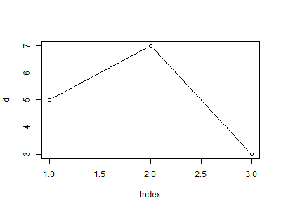  
*Fig.1.1.ベクトル（値）の折れ線グラフ：変化を見る*

```R
  # Fig.1.1.ベクトル（値）の折れ線グラフ：変化を見る
  plot(d,type="b")
```

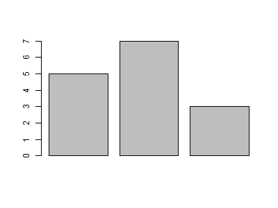  
*Fig.1.2.ベクトル（値）棒グラフ：頻度をみる*

```R
  # Fig.1.2.ベクトル（値）棒グラフ：頻度をみる
  barplot(d)
```

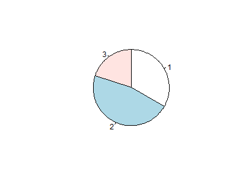  
*Fig.1.3.ベクトル（値）円グラフ：割合を見る*

```R
  # Fig.1.3.ベクトル（値）円グラフ：割合を見る
  pie(d, clockwise = T)
```

----------------------------------------------------------------------

## ベクトル（２：重複あり）

### データ

| vector | r1 | r2 | r3 | r4 | r5 | r6 | .. | 20 |
|--------|----|----|----|----|----|----|----|----|
|  c1    |  1 |  2 |  1 |  3 |  2 |  1 | .. |  1 |

（表示の都合で転置、横方向に）

```R
# [1,2,1,3,2,1,1,1,1,1,1,2,1,3,1,1,1,1,1,1]
d = c(1,2,1,3,2,1,1,1,1,1,1,2,1,3,1,1,1,1,1,1)
df = data.frame(c1=d)
```

#### ほかのデータ例

```R
# [2, 1, 3, 1, NA, 2, ..]
d = sample(c(1,2,3,NA), size=100, replace=T, prob=c(.34, .4, .23, .03))
df = data.frame(c1=d)
head(d)

# [a, c, b, a, b, b, ..]
d = sample(c("a","b","c"), size=100, replace=T, prob=c(.6, .3, .1))
df = data.frame(c1=d)
head(d)
```

#### データの中身を確認する操作

```R

head(d)

# [1] 1 2 1 3 2 1

# ----------

str(d)

#  num [1:20] 1 2 1 3 2 1 1 1 1 1 ...

# ----------

summary(d)

#   Min. 1st Qu.  Median    Mean 3rd Qu.    Max. 
#   1.00    1.00    1.00    1.35    1.25    3.00 

# ----------

table(d,useNA="ifany")

# d
#  1  2  3 
# 15  3  2 

# ----------

addmargins(table(d,useNA="ifany"))

# d
#   1   2   3 Sum 
#  15   3   2  20 

# ----------

length(d)

# [1] 20

# ----------

library(dplyr)
n_distinct(d)

# [1] 3

# ----------

unique(d)

# [1] 1 2 3
```


### グラフ

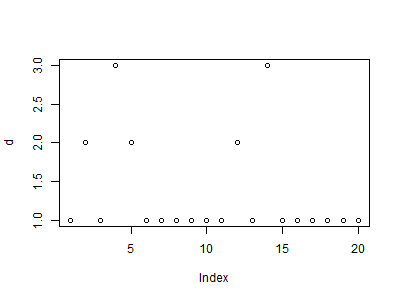  
*Fig.2.1*

```R
  # Fig.2.1
  plot(d)
```

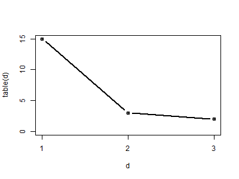  
*Fig.2.2.頻度数（table）を描画*

```R
  # Fig.2.2.頻度数（table）を描画
  plot(table(d), type="b")
```

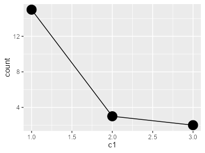  
*Fig.2.3.描画時にカウント*

```R
# Fig.2.3.描画時にカウント
library(ggplot2)
ggplot(df, aes(x=c1)) +
  geom_line(stat="count") +
  geom_point(stat="count",size=6)
```

  
*Fig.2.4.ヒストグラム*

```R
  # Fig.2.4.ヒストグラム
  hist(d)
```

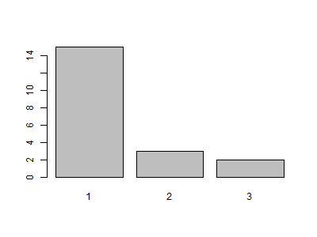  
*Fig.2.5.頻度数（table）を棒グラフで描画*

```R
  # Fig.2.5.頻度数（table）を棒グラフで描画
  barplot(table(d))
```

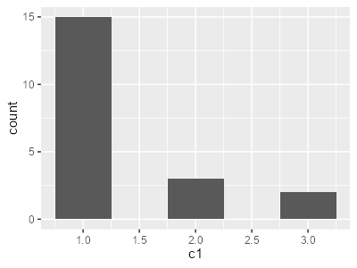  
*Fig.2.6.ヒストグラム*

```R
# Fig.2.6.ヒストグラム
library(ggplot2)
ggplot(df, aes(x=c1)) +
  geom_histogram(binwidth = 0.5)
```

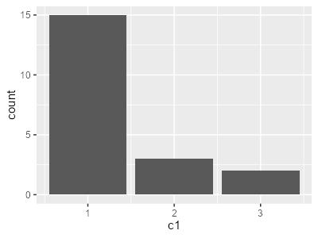  
*Fig.2.7.棒グラフで頻度を表現*

```R
# Fig.2.7.棒グラフで頻度を表現
library(ggplot2)
ggplot(df, aes(x=c1)) +
  geom_bar(stat="count")
```

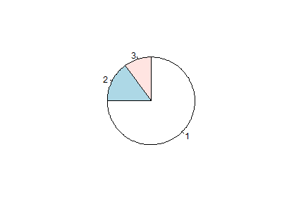  
*Fig.2.8.頻度数（table）を円グラフで描画*

```R
  # Fig.2.8.頻度数（table）を円グラフで描画
  pie(table(d),clockwise = "T")
```

----------------------------------------------------------------------

## ベクトル（３：カテゴリ分類操作あり）

### データ

| vector | r1 | r2 | r3 | r4 | r5 | r6 | rX |
|--------|----|----|----|----|----|----|----|
|  c1    |  2 |  1 |  1 |  2 |  1 |  3 | .. |

（表示の都合で転置、横方向に）

```R
# 均一分布の乱数で 最小(min)、最大(max)範囲の整数を、個数(10)発生させ、floorで整数化
d = floor(runif(100, min=1000, max=9999))

# [1] 3964 3026 4755 6330 8538 5981
```

#### ほかのデータ例

```R
# 正規分布の乱数
d = rnorm(100)
```

### データ加工

```R
# カテゴリ化（閾値による分類）
df <- data.frame(c1=d) |>
  mutate(c2 = case_when(c1 <1000 ~ "-1000",
                        c1 >= 1000 & c1 < 2000 ~ "1k-2k",
                        c1 >= 2000 & c1 < 5000 ~ "2k-5k",
                        c1 >= 5000 & c1 < 8000 ~ "5k-8k",
                        c1 >= 8000 ~ "8k-")) |>
  mutate(c2 = as.factor(c2))

# カテゴリ値によるグループ化と集計
#   n        .. そのカテゴリのレコード数（重複行あり）
#   c1_ndist .. そのカテゴリにある一意なc1の数（重複値なし）
#   c1_sum   .. そのカテゴリにc1の和
#   c1_mean  .. そのカテゴリにc1の平均値
df2 <- df |>
  group_by(c2) |>
  summarise(n=n(),
            c1_ndist=n_distinct(c1),
            c1_sum=sum(c1),
            c1_mean=mean(c1)) |>
  ungroup()
```

#### データの中身を確認する操作

```R
head(d)

# [1] 3265 7556 4210 2602 5082 9389

# ----------

str(d)

# num [1:20] 3265 7556 4210 2602 5082 ...

# ----------

summary(d)

# num [1:20] 3265 7556 4210 2602 5082 ...

# ----------

head(df)

#     c1    c2
# 1 3265 2k-5k
# 2 7556 5k-8k
# 3 4210 2k-5k
# 4 2602 2k-5k
# 5 5082 5k-8k
# 6 9389   8k-

# ----------

summary(df)

#        c1           c2    
#  Min.   :1790   1k-2k: 1  
#  1st Qu.:3091   2k-5k:10  
#  Median :4796   5k-8k: 5  
#  Mean   :5187   8k-  : 4  
#  3rd Qu.:6994             
#  Max.   :9668  

# ----------

table(df$c2)

# 1k-2k 2k-5k 5k-8k   8k- 
#     1    10     5     4 

# ----------

df2

# # A tibble: 4 × 5
#   c2        n c1_ndist c1_sum c1_mean
#   <fct> <int>    <int>  <dbl>   <dbl>
# 1 1k-2k     1        1   1790   1790 
# 2 2k-5k    10       10  34516   3452.
# 3 5k-8k     5        5  31084   6217.
# 4 8k-       4        4  36347   9087.
```

### グラフ

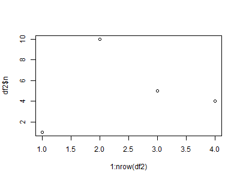  
*Fig.3.1.カテゴリごとの頻度（集計したデータを利用）*

```R
  # Fig.3.1.カテゴリごとの頻度（集計したデータを利用）
  plot(x=1:nrow(df2), y=df2$n)
```

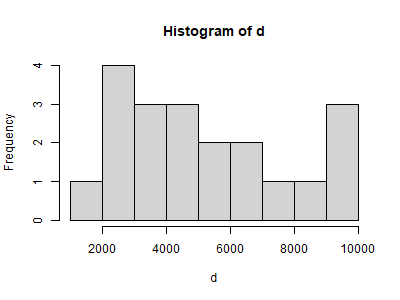  
*Fig.3.2.カテゴリごとの頻度（未集計の生データを利用）*

```R
  # Fig.3.2.カテゴリごとの頻度（未集計の生データを利用）
  hist(d)
```

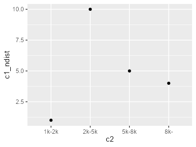  
*Fig.3.3.カテゴリごとの頻度（集計したデータを利用）*

```R
# Fig.3.3.カテゴリごとの頻度（集計したデータを利用）
library(ggplot2)
ggplot(df2) +
  geom_point(mapping = aes(x = c2, y = c1_ndist))
```

つづきは
「データフレーム（２：カテゴリ値と連続値）」
で

----------------------------------------------------------------------

## matrix

### データ

| matrix| c1 | c2 | c3 | c4 | c5 |
|-------|----|----|----|----|----|
|  r1   |  5 |  7 |  9 | 11 | 13 |
|  r2   | 16 |  8 |  4 |  2 |  1 |

```R
d=matrix(c(5,16,7,8,9,4,11,2,13,1),2,5)

#      [,1] [,2] [,3] [,4] [,5]
# [1,]    5    7    9   11   13
# [2,]   16    8    4    2    1
```

#### データの中身を確認する操作

```R
addmargins(d)

#                    Sum
#      5  7  9 11 13  45
#     16  8  4  2  1  31
# Sum 21 15 13 13 14  76

# ----------

round(prop.table(d), 2)

#      [,1] [,2] [,3] [,4] [,5]
# [1,] 0.07 0.09 0.12 0.14 0.17
# [2,] 0.21 0.11 0.05 0.03 0.01

# ----------

addmargins(round(prop.table(d), 2))

#                              Sum
#     0.07 0.09 0.12 0.14 0.17 0.59
#     0.21 0.11 0.05 0.03 0.01 0.41
# Sum 0.28 0.20 0.17 0.17 0.18 1.00
```

### グラフ

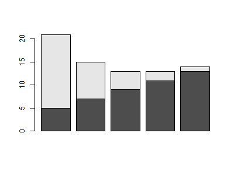  
*Fig.4.1.棒グラフ：積み上げ（積層）*

```R
  # Fig.4.1.棒グラフ：積み上げ（積層）
  barplot(d)
```

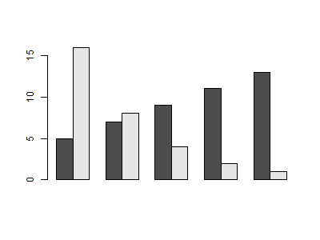  
*Fig.4.2.棒グラフ：横に並べる*

```R
  # Fig.4.2.棒グラフ：横に並べる
  barplot(d,beside=T)
```

----------------------------------------------------------------------

## データフレーム（１：連続値ｘ２）

### データ

| dataframe | c1 | c2 |
|-----------|----|----|
|  r1       |  5 | 16 |
|  r2       |  7 |  8 |
|  r3       |  9 |  4 |
|  r4       | 11 |  2 |
|  r5       | 13 |  1 |

```R
c1 = c( 5,  7,  9, 11, 13)
c2 = c(16,  8,  4,  2,  1)
d = data.frame(c1,c2)

#   c1 c2
# 1  5 16
# 2  7  8
# 3  9  4
# 4 11  2
# 5 13  1
```

#### ほかのデータ例

```R
#   tibble型のデータフレームの例（１）
d = data_frame(c1,c2)

# # A tibble: 5 × 2
#      c1    c2
#   <dbl> <dbl>
# 1     5    16
# 2     7     8
# 3     9     4
# 4    11     2
# 5    13     1

#   tibble型のデータフレームの例（２）
d = tibble(c1,c2)

```

### データ加工

```R
# index列を追加
d2 <- d |>
  mutate(idx=1:nrow(d))
```

#### データの中身を確認する操作

```R
head(d)

#   c1 c2
# 1  5 16
# 2  7  8
# 3  9  4
# 4 11  2
# 5 13  1

# ----------

str(d)

# dataframeの場合
# 'data.frame':	5 obs. of  2 variables:
#  $ c1: num  5 7 9 11 13
#  $ c2: num  16 8 4 2 1

# 参考：tibbleの場合
# tibble [5 × 2] (S3: tbl_df/tbl/data.frame)
#  $ c1: num [1:5] 5 7 9 11 13
#  $ c2: num [1:5] 16 8 4 2 1

# ----------

summary(d)

#       c1           c2      
# Min.   : 5   Min.   : 1.0  
# 1st Qu.: 7   1st Qu.: 2.0  
# Median : 9   Median : 4.0  
# Mean   : 9   Mean   : 6.2  
# 3rd Qu.:11   3rd Qu.: 8.0  
# Max.   :13   Max.   :16.0 
```

### グラフ

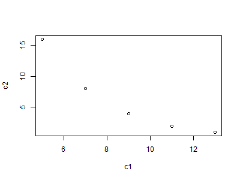  
*Fig.5.1.*

```R
  # Fig.5.1.
  plot(d)
```

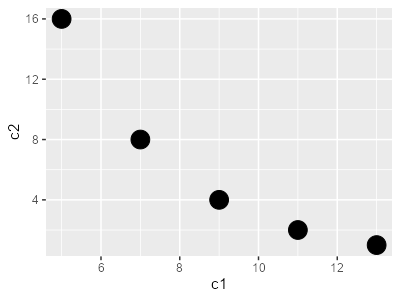  
*Fig.5.2.*

```R
# Fig.5.2.
library(ggplot2)
ggplot(d) +
  geom_point(aes(x = c1, y = c2), size=6)
```

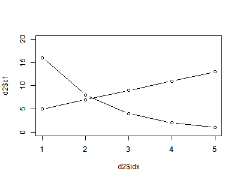  
*Fig.5.3.Indexを追加したデータを使い２列のグラフを重ねる*

```R
  # Fig.5.3.Indexを追加したデータを使い２列のグラフを重ねる
  plot(x=d2$idx, y=d2$c1, type="b", ylim=c(0,20))
  par(new=T)
  plot(x=d2$idx, y=d2$c2, type="b", ylim=c(0,20), ann=F)
```

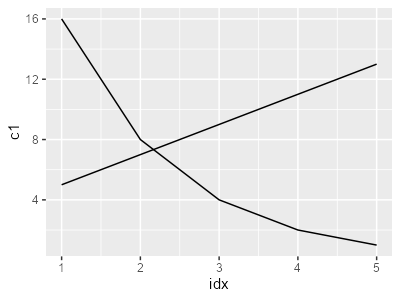  
*Fig.5.4.Indexを追加したデータを使い２列のグラフを重ねる（２）*

```R
# Fig.5.4.Indexを追加したデータを使い２列のグラフを重ねる（２）
library(ggplot2)
ggplot(d2) +
  geom_line(mapping = aes(x = idx, y = c1)) +
  geom_line(mapping = aes(x = idx, y = c2))
```

----------------------------------------------------------------------

## データフレーム（２：カテゴリ値と連続値）

### データ

| dataframe | c1 | c2 |
|-----------|----|----|
|  r1       |  a |  3 |
|  r2       |  b |  7 |
|  r3       |  c |  5 |

```R
c1 = c("a","b","c")
c2 = c(3,7,5)
d = data.frame(c1=as.factor(c1),c2=c2)

# c1 | c2
# ---|----
# a  | 3
# b  | 7
# c  | 5
```

####  データの中身を確認する操作

```R
head(d)

#   c1 c2
# 1  a  3
# 2  b  7
# 3  c  5

# --------

str(d)

# # d = data.frame(c1=as.factor(c1),c2=c2) のときのstr()
# 'data.frame':	3 obs. of  2 variables:
#  $ c1: Factor w/ 3 levels "a","b","c": 1 2 3
#  $ c2: num  3 7 5

# # 参考： d = data.frame(c1,c2) のときのstr()
# 'data.frame':	3 obs. of  2 variables:
#  $ c1: chr  "a" "b" "c"
#  $ c2: num  3 7 5

# --------

summary(d)

# c1          c2   
# a:1   Min.   :3  
# b:1   1st Qu.:4  
# c:1   Median :5  
#       Mean   :5  
#       3rd Qu.:6  
#       Max.   :7 

# --------

table(d)

#    c2
# c1  3 5 7
#   a 1 0 0
#   b 0 0 1
#   c 0 1 0
```

### グラフ

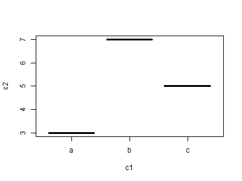  
*Fig.6.1.*

```R
  # Fig.6.1.
  plot(d)
```

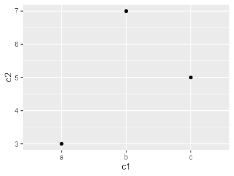  
*Fig.6.2.*

```R
# Fig.6.2.
library(ggplot2)
ggplot(d) +
  geom_point(mapping = aes(x = c1, y = c2))
```

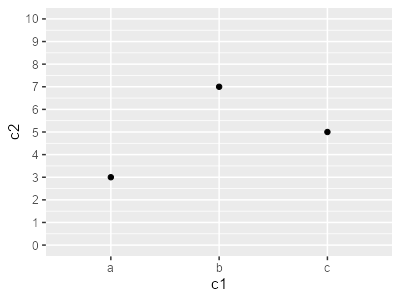  
*Fig.6.3.散布図（Y軸のスケールを調整）*

```R
# Fig.6.3.散布図（Y軸のスケールを調整）
ggplot(d) +
  geom_point(mapping = aes(x = c1, y = c2)) +
  scale_y_continuous(breaks=seq(0,10),limits=c(0,10))
```

  
*Fig.6.4.カテゴリごとの値を棒グラフで*

```R
# Fig.6.4.カテゴリごとの値を棒グラフで
ggplot(d, aes(x = c1, y = c2)) +
  geom_bar(stat = "identity")
```

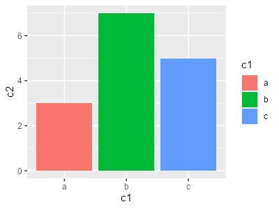  
*Fig.6.5.カテゴリごとの値を棒グラフで＋装飾（カテゴリ値で色分け）*

```R
# Fig.6.5.カテゴリごとの値を棒グラフで＋装飾（カテゴリ値で色分け）
ggplot(d, aes(x = c1, y = c2, fill=c1)) +
  geom_bar(stat = "identity")
```

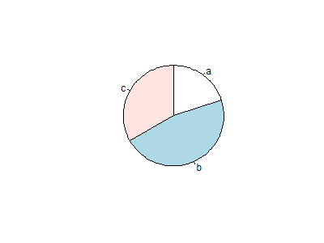  
*Fig.6.6.*

```R
  # Fig.6.6.
  pie(x=d$c2, label=d$c1, clockwise = T)
```

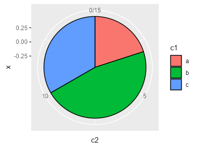  
*Fig.6.7.ラフな円グラフ*

```R
# Fig.6.7.ラフな円グラフ
ggplot(d, aes(x=0, y=c2, fill=c1)) +
  geom_col(color="black", position=position_stack(reverse=T)) +
  coord_polar("y")
```

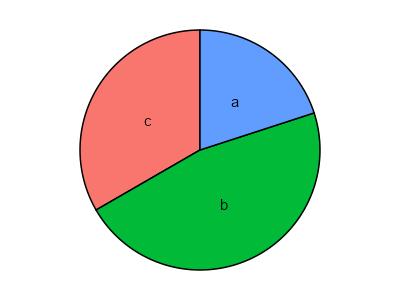  
*Fig.6.8.円グラフ：時計回りの順に並べる*

```R
# Fig.6.8.円グラフ：時計回りの順に並べる
ggplot(d, aes(x=0, y=rev(c2), fill=c1)) +
  geom_col(color="black") +
  coord_polar("y") +
  geom_text(aes(label=rev(c1)), position=position_stack(vjust=0.5)) +
  theme_void() +
  theme(legend.position = "none")
```

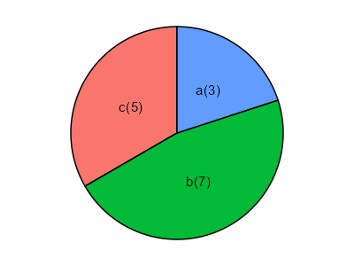  
*Fig.6.9.円グラフ：時計回りの順、ラベル名調整*

```R
# Fig.6.9.円グラフ：時計回りの順、ラベル名調整
d |>
  mutate(vlbl = paste0(c1,"(",c2,")")) |>
  mutate(ypos = cumsum(c2) - c2/2) |>
  ggplot(aes(x=0, y=rev(c2), fill=c1)) +
    geom_col(color="black") +
    coord_polar("y") +
    geom_text(aes(y=ypos, label=vlbl), size=4) +
    theme_void() +
    theme(legend.position="none")
```

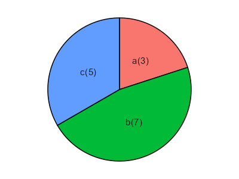  
*Fig.6.10.円グラフ：時計回りの順、ラベル名調整、配色修正*

```R
# Fig.6.10.円グラフ：時計回りの順、ラベル名調整、配色修正
d |>
  mutate(vlbl = paste0(c1,"(",c2,")")) |>
  mutate(ypos = cumsum(c2) - c2/2) |>
  ggplot(aes(x=0, y=c2, fill=c1)) +
    geom_bar(stat="identity", color="black", position=position_stack(reverse=T)) +
    geom_text(aes(y=ypos, label=vlbl), size=4) +
    coord_polar("y") +
    theme_void() +
    theme(legend.position="none")
```

----------------------------------------------------------------------

## データフレーム（３：カテゴリ値と連続値／カテゴリの重複）

### データ

| dataframe | c1 | c2 |
|-----------|----|----|
|  r1       |  a |  1 |
|  r2       |  a |  1 |
|  r3       |  a |  2 |
|  r4       |  a |  3 |
|  r5       |  b |  5 |
|  r6       |  c |  8 |


```R
c1 = c("a","a","a","a","b","c")
c2 = c(1, 1, 2, 3, 5, 8)
d = data.frame(c1=as.factor(c1),c2)

#   c1 c2
# 1  a  1
# 2  a  1
# 3  a  2
# 4  a  3
# 5  b  5
# 6  c  8
```

### データ加工

```R
# indexを追加
d0 <- d |>
  mutate(c0 = 1:nrow(d))

#   c1 c2 c0
# 1  a  1  1
# 2  a  1  2
# 3  a  2  3
# 4  a  3  4
# 5  b  5  5
# 6  c  8  6
```

#### データの中身を確認する操作

```R
head(d)

#   c1 c2
# 1  a  1
# 2  a  1
# 3  a  2
# 4  a  3
# 5  b  5
# 6  c  8

# --------

str(d)

# 'data.frame':	6 obs. of  2 variables:
#  $ c1: Factor w/ 3 levels "a","b","c": 1 1 1 1 2 3
#  $ c2: num  1 1 2 3 5 8

# --------

summary(d)

# c1          c2       
# a:4   Min.   :1.000  
# b:1   1st Qu.:1.250  
# c:1   Median :2.500  
#       Mean   :3.333  
#       3rd Qu.:4.500
#       Max.   :8.000  

# --------

table(d)

#    c2
# c1  1 2 3 5 8
#   a 2 1 1 0 0
#   b 0 0 0 1 0
#   c 0 0 0 0 1
```

### グラフ

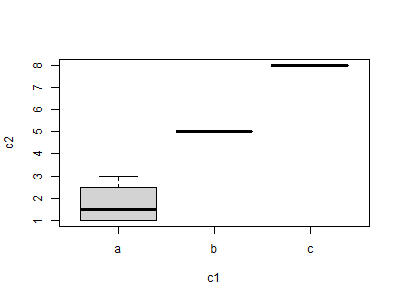  
*Fig.7.1.カテゴリごとの分布*

```R
  # Fig.7.1.カテゴリごとの分布
  plot(d, type="b")
```

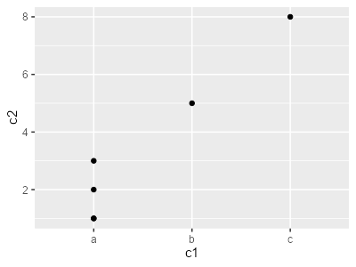  
*Fig.7.2.カテゴリごとの分布：散布図*

```R
# Fig.7.2.カテゴリごとの分布：散布図
library(ggplot2)
ggplot(d) +
  geom_point(mapping = aes(x = c1, y = c2))
```

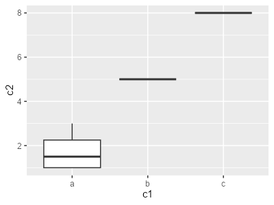  
*Fig.7.3.カテゴリごとの分布：箱ひげ図*

```R
# Fig.7.3.カテゴリごとの分布：箱ひげ図
ggplot(d) +
  geom_boxplot(aes(x = c1, y = c2))
```

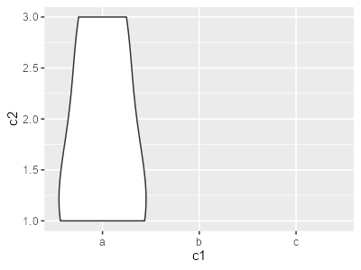  
*Fig.7.4.カテゴリごとの分布：バイオリンプロット*

```R
# Fig.7.4.カテゴリごとの分布：バイオリンプロット
ggplot(d) +
  geom_violin(aes(x = c1, y = c2))
```

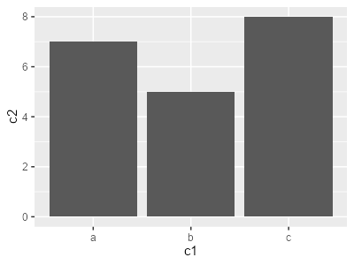  
*Fig.7.5.カテゴリごとの和*

```R
# Fig.7.5.カテゴリごとの和
ggplot(d, aes(x = c1, y = c2)) +
  geom_bar(stat = "identity")
```

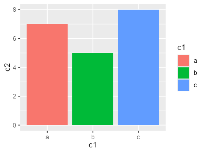  
*Fig.7.6.カテゴリごとの和：カテゴリで色分け*

```R
# Fig.7.6.カテゴリごとの和：カテゴリで色分け
ggplot(d, aes(x = c1, y = c2, fill=c1)) +
  geom_bar(stat = "identity")
```

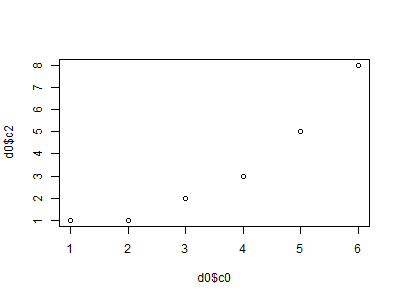  
*Fig.7.7.indexと値の散布図*

```R
  # Fig.7.7.indexと値の散布図
  plot(d0$c0, d0$c2)
```

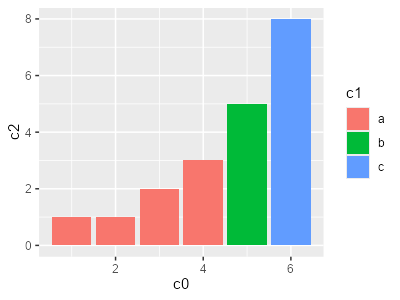  
*Fig.7.8.indexと値の棒グラフ：カテゴリで色分け*

```R
# Fig.7.8.indexと値の棒グラフ：カテゴリで色分け
ggplot(d0, aes(x = c0, y = c2, fill=c1)) +
  geom_bar(stat = "identity")
```

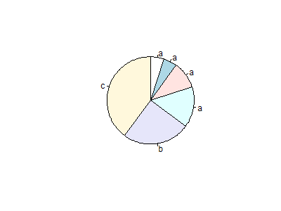  
*Fig.7.9.*

```R
  # Fig.7.9.
  pie(x=d$c2, label=d$c1, clockwise = T)
```

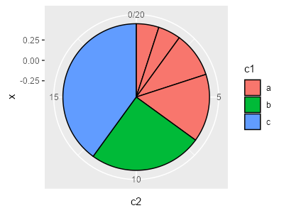  
*Fig.7.10.ラフな円グラフ*

```R
# Fig.7.10.ラフな円グラフ
ggplot(d, aes(x=0, y=c2, fill=c1)) +
  geom_col(color="black", position=position_stack(reverse=T)) +
  coord_polar("y")
```

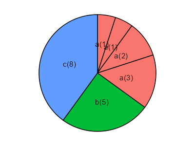  
*Fig.7.11.カテゴリ別の円グラフ*

```R
# Fig.7.11.カテゴリ別の円グラフ
# .. 描画時にカテゴリでfillしているためか、最初にカテゴリでソート済みに（arrange）しておく
d |>
  arrange(c1) |>
  mutate(vlbl = paste0(c1,"(",c2,")")) |>
  mutate(ypos = cumsum(c2) - c2/2) |>
  ggplot(aes(x=0, y=c2, fill=c1)) +
    geom_bar(stat="identity", color="black", position=position_stack(reverse=T)) +
    geom_text(aes(y=ypos, label=vlbl), size=4) +
    coord_polar("y") +
    theme_void() +
    theme(legend.position="none")
```

----------------------------------------------------------------------

## データフレーム（４：連続値×３）

### データ

| dataframe | c1 | c2 | c3 |
|-----------|----|----|----|
|  r1       | 11 |  5 | 16 |
|  r2       | 12 |  7 |  8 |
|  r3       | 13 |  9 |  4 |
|  r4       | 14 | 11 |  2 |
|  r5       | 15 | 13 |  1 |

```R
c1 = 11:15
c2 = c( 5,  7,  9, 11, 13)
c3 = c(16,  8,  4,  2,  1)
d = data.frame(c1,c2,c3)

#   c1 c2 c3
# 1 11  5 16
# 2 12  7  8
# 3 13  9  4
# 4 14 11  2
# 5 15 13  1
```

### データ加工

```R
# indexを追加
library(dplyr)
d0 <- d |>
  mutate(c0 = 1:nrow(d))

#   c1 c2 c3 c0
# 1 11  5 16  1
# 2 12  7  8  2
# 3 13  9  4  3
# 4 14 11  2  4
# 5 15 13  1  5
```

#### データの中身を確認する操作

```R
head(d)

#   c1 c2 c3
# 1 11  5 16
# 2 12  7  8
# 3 13  9  4
# 4 14 11  2
# 5 15 13  1

# ----------

str(d)

# # d = data.frame(c1,c2,c3)
# data.frame':	5 obs. of  3 variables:
# $ c1: int  11 12 13 14 15
# $ c2: num  5 7 9 11 13
# $ c3: num  16 8 4 2 1

# 参考：tibbleの場合
# # d = data_frame(c1,c2,c3)
# tibble [5 × 3] (S3: tbl_df/tbl/data.frame)
# $ c1: int [1:5] 11 12 13 14 15
# $ c2: num [1:5] 5 7 9 11 13
# $ c3: num [1:5] 16 8 4 2 1

# ----------

summary(d)

#       c1           c2           c3      
# Min.   :11   Min.   : 5   Min.   : 1.0  
# 1st Qu.:12   1st Qu.: 7   1st Qu.: 2.0  
# Median :13   Median : 9   Median : 4.0  
# Mean   :13   Mean   : 9   Mean   : 6.2  
# 3rd Qu.:14   3rd Qu.:11   3rd Qu.: 8.0  
# Max.   :15   Max.   :13   Max.   :16.0 
```

### グラフ

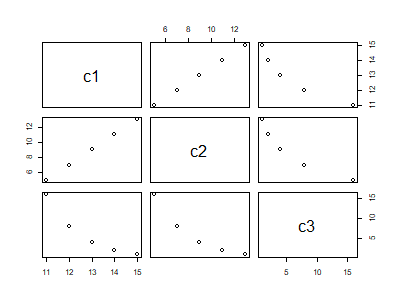  
*Fig.8.1.*

```R
  # Fig.8.1.
  plot(d)
```

  
*Fig.8.2.c1をX軸として、c2,c3の折れ線グラフ*

```R
  # Fig.8.2.c1をX軸として、c2,c3の折れ線グラフ
  plot(x=d$c1, y=d$c2, type="b", col=1, ylim=c(0,20), xlab="c1", ylab="c2,c3")
  par(new=T)
  plot(x=d$c1, y=d$c3, type="b", col=2, ylim=c(0,20), ann=F)
  legend("topleft", legend=c("c1", "c2"), lty=1, col=1:2)
```

  
*Fig.8.3.*

```R
# Fig.8.3.
library(ggplot2)
ggplot(d) +
  geom_point(mapping = aes(x = c1, y = c2), size=4) +
  geom_line(mapping = aes(x = c1, y = c2)) +
  geom_point(mapping = aes(x = c1, y = c3), color="red", size=4) +
  geom_line(mapping = aes(x = c1, y = c3), color="red")
```

  
*Fig.8.4.c1をX軸として、c2,c3の棒グラフ*

```R
# Fig.8.4.c1をX軸として、c2,c3の棒グラフ
#   .. ずらして描画できない？ので半透明で重ねる
ggplot(d) +
  geom_bar(mapping = aes(x = c1, y = c2), stat="identity", width=0.8, color="red", alpha=1/3) +
  geom_bar(mapping = aes(x = c1, y = c3), stat="identity", width=0.5, color="blue", alpha=1/3)
```

  
*Fig.8.5.c1をX軸として、c2の棒グラフとc3の折れ線グラフ*

```R
# Fig.8.5.c1をX軸として、c2の棒グラフとc3の折れ線グラフ
ggplot(d) +
  geom_bar(aes(x = c1, y = c2), stat="identity") +
  geom_point(aes(x = c1, y = c3), stat="identity", color="blue") +
  geom_line(aes(x = c1, y = c3), stat="identity", color="blue")
```

----------------------------------------------------------------------

## データフレーム（５：連続値×２とカテゴリ値）

### データ

| dataframe | c1 | c2 | c3 |
|-----------|----|----|----|
|  r1       | 11 |  5 |  a |
|  r2       | 12 |  7 |  a |
|  r3       | 13 |  9 |  a |
|  r4       | 14 | 11 |  a |
|  r5       | 15 | 13 |  a |
|  r6       | 11 | 16 |  b |
|  r7       | 12 |  8 |  b |
|  r8       | 13 |  4 |  b |
|  r9       | 14 |  2 |  b |
|  r10      | 15 |  1 |  b |

```R
c1a = 11:15
c2a = c( 5,  7,  9, 11, 13)
c3a = rep("a", length(c1a))
c2b = c(16,  8,  4,  2,  1)
c3b = rep("b", length(c1a))
c1 = c(c1a,c1a)
c2 = c(c2a,c2b)
c3 = c(c3a,c3b)
d = data.frame(c1,c2,c3=as.factor(c3))

#    c1 c2 c3
# 1  11  5  a
# 2  12  7  a
# 3  13  9  a
# 4  14 11  a
# 5  15 13  a
# 6  11 16  b
# 7  12  8  b
# 8  13  4  b
# 9  14  2  b
# 10 15  1  b
```

#### ほかのデータ例

```R
#   Rに標準に格納
iris

#   Sepal.Length Sepal.Width Petal.Length Petal.Width Species
# 1          5.1         3.5          1.4         0.2  setosa
# 2          4.9         3.0          1.4         0.2  setosa
# 3          4.7         3.2          1.3         0.2  setosa
# 4          4.6         3.1          1.5         0.2  setosa
# 5          5.0         3.6          1.4         0.2  setosa
# 6          5.4         3.9          1.7         0.4  setosa
```

### データ加工

```R
# indexを追加
library(dplyr)
d0 <- d |>
  mutate(c0 = 1:nrow(d))

#    c1 c2 c3 c0
# 1  11  5  a  1
# 2  12  7  a  2
# 3  13  9  a  3
# 4  14 11  a  4
# 5  15 13  a  5
# 6  11 16  b  6
# 7  12  8  b  7
# 8  13  4  b  8
# 9  14  2  b  9
# 10 15  1  b 10
```

#### データの中身を確認する操作

```R
head(d)

#   c1 c2 c3
# 1 11  5  a
# 2 12  7  a
# 3 13  9  a
# 4 14 11  a
# 5 15 13  a
# 6 11 16  b

# ----------

str(d)

# 'data.frame':	10 obs. of  3 variables:
# $ c1: int  11 12 13 14 15 11 12 13 14 15
# $ c2: num  5 7 9 11 13 16 8 4 2 1
# $ c3: Factor w/ 2 levels "a","b": 1 1 1 1 1 2 2 2 2 2

# ----------

summary(d)

#       c1           c2        c3   
# Min.   :11   Min.   : 1.00   a:5  
# 1st Qu.:12   1st Qu.: 4.25   b:5  
# Median :13   Median : 7.50        
# Mean   :13   Mean   : 7.60        
# 3rd Qu.:14   3rd Qu.:10.50        
# Max.   :15   Max.   :16.00  
```

### グラフ

  
*Fig.9.1.相関プロット群*

```R
  # Fig.9.1.相関プロット群
  plot(d)
```

  
*Fig.9.2.カテゴリ値（c3）と連続値（c2）の分布*

```R
  # Fig.9.2.カテゴリ値（c3）と連続値（c2）の分布
  plot(d$c3, d$c2)
```

  
*Fig.9.3.カテゴリ値（c3）と連続値（c2）の分布：箱ひげ図*

```R
# Fig.9.3.カテゴリ値（c3）と連続値（c2）の分布：箱ひげ図
library(ggplot2)
ggplot(d) +
  geom_boxplot(aes(x = c3, y = c2)) 
```

  
*Fig.9.4.カテゴリ値（c3）と連続値（c2）の分布：バイオリンプロット*

```R
# Fig.9.4.カテゴリ値（c3）と連続値（c2）の分布：バイオリンプロット
ggplot(d) +
  geom_violin(aes(x = c3, y = c2))
```

  
*Fig.9.5.カテゴリ値（iris.Speces）と連続値（iris.Sepal.Length）の分布：バイオリンプロット＋箱ひげ図*

```R
# Fig.9.5.カテゴリ値（iris.Speces）と連続値（iris.Sepal.Length）の分布：バイオリンプロット＋箱ひげ図
ggplot(iris, aes(x = Species, y = Sepal.Length, fill=Species)) +
  geom_violin() +
  geom_boxplot(width=.2, fill="white")+
  theme_classic()
```

  
*Fig.9.6.連続値（c1）と連続値（c2）の折れ線グラフ：カテゴリ別*

```R
# Fig.9.6.連続値（c1）と連続値（c2）の折れ線グラフ：カテゴリ別
library(ggplot2)
ggplot(d) +
  geom_line(mapping = aes(x = c1, y = c2, col=c3))
```

  
*Fig.9.7.連続値（c1）と連続値（c2）の棒グラフ：カテゴリの和*

```R
# Fig.9.7.連続値（c1）と連続値（c2）の棒グラフ：カテゴリの和
ggplot(d, aes(x = c1, y = c2)) +
  geom_bar(stat="identity")
```

  
*Fig.9.8.連続値（c1）と連続値（c2）の棒グラフ：カテゴリ別積層*

```R
# Fig.9.8.連続値（c1）と連続値（c2）の棒グラフ：カテゴリ別積層
ggplot(d, aes(x = c1, y = c2, fill=c3)) +
  geom_bar(stat="identity")
```

  
*Fig.9.9.連続値（c1）と連続値（c2）の棒グラフ：カテゴリ別横並び*

```R
# Fig.9.9.連続値（c1）と連続値（c2）の棒グラフ：カテゴリ別横並び
ggplot(d, aes(x = c1, y = c2, fill=c3)) +
  geom_bar(stat="identity", position=position_dodge())
```

  
*Fig.9.10.連続値（iris.Sepal.Width）と連続値（iris.Sepal.Length）の散布図：カテゴリ別*

```R
# Fig.9.10.連続値（iris.Sepal.Width）と連続値（iris.Sepal.Length）の散布図：カテゴリ別
ggplot(iris) +
  geom_point(mapping = aes(x = Sepal.Width, y = Sepal.Length, color=Species))
```

----------------------------------------------------------------------

## データフレーム（６：連続値とカテゴリ値×２）

### データ

| dataframe | c1 | c2 | c3 |
|-----------|----|----|----|
|  r1       |  1 |  a | XX |
|  r2       |  1 |  a | XX |
|  r3       |  2 |  a | XX |
|  r4       |  3 |  a | YY |
|  r5       |  5 |  b | XX |
|  r6       |  8 |  b | YY |

```R
c1 = c(1, 1, 2, 3, 5, 8,13,21,35,56,91,147)
c2 = c("a","a","a","a","b","b","b","b","c","c","c","c")
c3 = c("XX", "XX", "XX", "YY", "XX", "XX","XX", "XX", "XX", "YY", "XX", "YY")
d = data.frame(c1,c2=as.factor(c2),c3=as.factor(c3))

#     c1 c2 c3
# 1    1  a XX
# 2    1  a XX
# 3    2  a XX
# 4    3  a YY
# 5    5  b XX
# 6    8  b XX
# 7   13  b XX
# 8   21  b XX
# 9   35  c XX
# 10  56  c YY
# 11  91  c XX
# 12 147  c YY
```

### データ加工

```R
# カテゴリ列(c2,c3)でグループ化して集計
library(dplyr)
d2 <- d |>
  group_by(c2,c3) |>
  summarise(vn=n(),
            vsum=sum(c1)) |>
  ungroup()

# # A tibble: 5 × 4
#   c2    c3       vn  vsum
#   <fct> <fct> <int> <dbl>
# 1 a     XX        3     4
# 2 a     YY        1     3
# 3 b     XX        4    47
# 4 c     XX        2   126
# 5 c     YY        2   203
```

#### データの中身を確認する操作

```R
head(d)

#   c1 c2 c3
# 1  1  a XX
# 2  1  a XX
# 3  2  a XX
# 4  3  a YY
# 5  5  b XX
# 6  8  b XX

# ----------

str(d)

# 'data.frame':	12 obs. of  3 variables:
#  $ c1: num  1 1 2 3 5 8 13 21 35 56 ...
#  $ c2: Factor w/ 3 levels "a","b","c": 1 1 1 1 2 2 2 2 3 3 ...
#  $ c3: Factor w/ 2 levels "XX","YY": 1 1 1 2 1 1 1 1 1 2 ...

# ----------

summary(d)

#        c1         c2     c3   
#  Min.   :  1.00   a:4   XX:9  
#  1st Qu.:  2.75   b:4   YY:3  
#  Median : 10.50   c:4         
#  Mean   : 31.92               
#  3rd Qu.: 40.25               
#  Max.   :147.00   

# ----------

table(d)

# , , c3 = XX
# 
#      c2
# c1    a b c
#   1   2 0 0
#   2   1 0 0
#   3   0 0 0
#   5   0 1 0
#   8   0 1 0
#   13  0 1 0
#   21  0 1 0
#   35  0 0 1
#   56  0 0 0
#   91  0 0 1
#   147 0 0 0
# 
# , , c3 = YY
# 
#      c2
# c1    a b c
#   1   0 0 0
#   2   0 0 0
#   3   1 0 0
#   5   0 0 0
#   8   0 0 0
#   13  0 0 0
#   21  0 0 0
#   35  0 0 0
#   56  0 0 1
#   91  0 0 0
#   147 0 0 1
```

### グラフ

  
*Fig.10.1.連続値（c1）の棒グラフ*

```R
  # 連続値（c1）の棒グラフ
  barplot(d$c1)
```

  
*Fig.10.2.カテゴリ値(c2)と連続値(c1)の分布*

```R
# カテゴリ値(c2)と連続値(c1)の分布
library(ggplot2)
ggplot(d, aes(x = c2, y = c1)) +
  geom_bar(stat="identity")
```

  
*Fig.10.3.カテゴリ値(c2)と連続値(c1)の分布：カテゴリ値(c3)で積層*

```R
# カテゴリ値(c2)と連続値(c1)の分布：カテゴリ値(c3)で積層
ggplot(d, aes(x = c2, y = c1, fill=c3)) +
  geom_bar(stat="identity")
```

  
*Fig.10.4.カテゴリ値(c2)と連続値(c1)の分布：カテゴリ値(c3)で横並び*

```R
# カテゴリ値(c2)と連続値(c1)の分布：カテゴリ値(c3)で横並び
# - カテゴリ(c3)別に横に並べる場合は別途group_by で集計したデータで描画が必要
ggplot(d2, aes(x = c2, y = sumc1, fill=c3)) +
  geom_bar(stat="identity", position = position_dodge())
```

  
*Fig.10.5.カテゴリ値(c2)と連続値(c1)の散布図*

```R
# カテゴリ値(c2)と連続値(c1)の散布図
ggplot(d) +
  geom_point(aes(x = c2, y = c1))
```

  
*Fig.10.6.カテゴリ値(c2)と連続値(c1)の散布図＋カテゴリ値(c3)でマーカ・色変更*

```R
# カテゴリ値(c2)と連続値(c1)の散布図＋カテゴリ値(c3)でマーカ・色変更
ggplot(d) +
  geom_point(aes(x = c2, y = c1, color=c3, pch=c3, size=2))
```

  
*Fig.10.7.カテゴリ値(c2)と連続値(c1)の箱ひげ図*

```R
  # カテゴリ値(c2)と連続値(c1)の箱ひげ図
  # boxplot(d$c2, d$c1) # こちらだとX軸が変。NA未対応？
  plot(d$c2, d$c1)
```

  
*Fig.10.8.*

```R
ggplot(d) +
  geom_boxplot(aes(x = c2, y = c1))
```

  
*Fig.10.9.カテゴリ値(c2)と連続値(c1)の箱ひげ図＋カテゴリ値(c3)で色分け*

```R
# カテゴリ値(c2)と連続値(c1)の箱ひげ図＋カテゴリ値(c3)で色分け
ggplot(d) +
  geom_boxplot(aes(x = c2, y = c1, color=c3))
```

  
*Fig.10.10.カテゴリ値(c2,c3)の組み合わせに対する連続値(c1)の和：散布図*

```R
# カテゴリ値(c2,c3)の組み合わせに対する連続値(c1)の和：散布図
# 内部でc1の和と取っている。size=c1だと大きすぎる。調整のためlogをとる
ggplot(d) +
  geom_point(aes(x = c2, y = c3), size=log(c1)*3)
```

(EOF)
